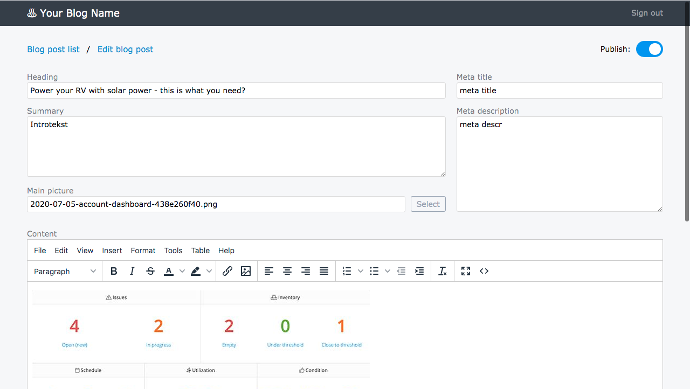

EmbedBlog is a LAMP based blog module that can be embedded with PHP on your site. It is based on the blog codebase used on www.itefy.com/blog/

## Installation

1. Upload all the files located in the www folder to your public site folder (usually called www, public_html etc.). You should now have a blog folder located directly under the www root.
2. Rename or copy _htaccess to .htaccess
3. Rename or copy config.sample.php to config.php
4. Create a database, and run the queries in the database.sql file. Create a database user that has all the privileges to the database
5. Edit the config.php file with the database server, username, password and database name.