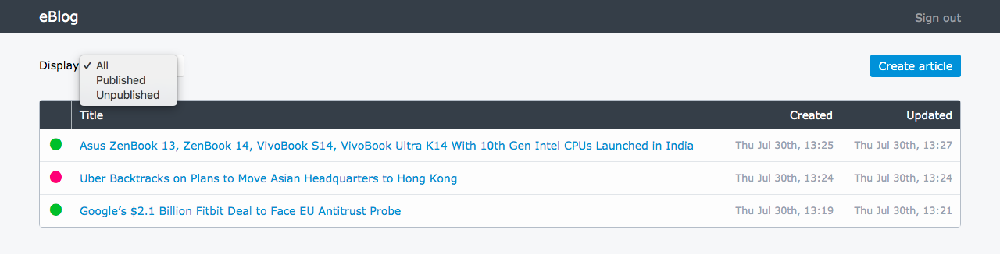
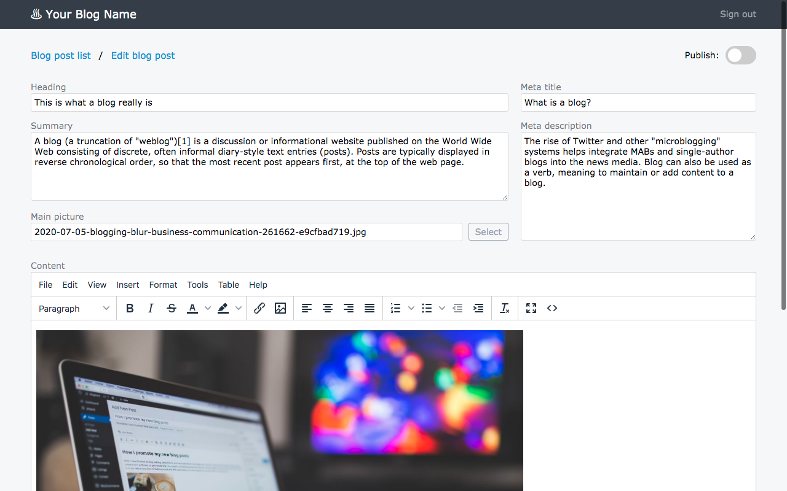
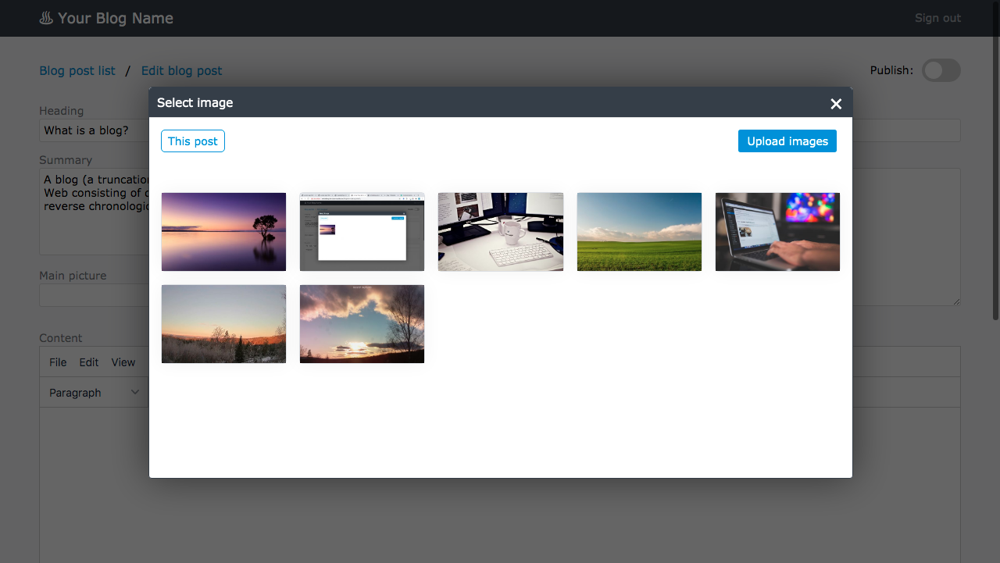
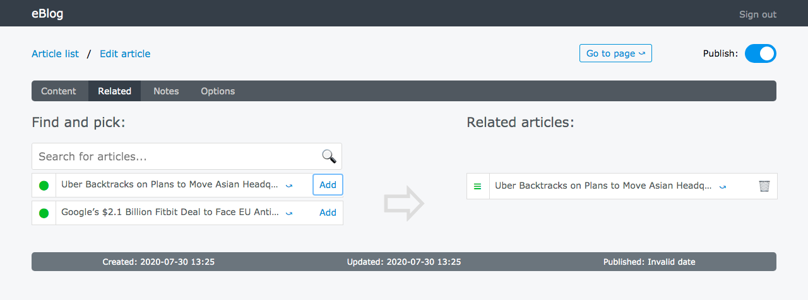
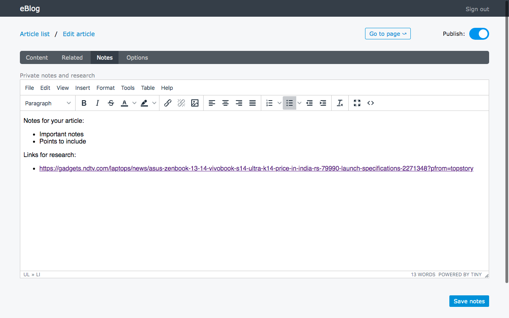
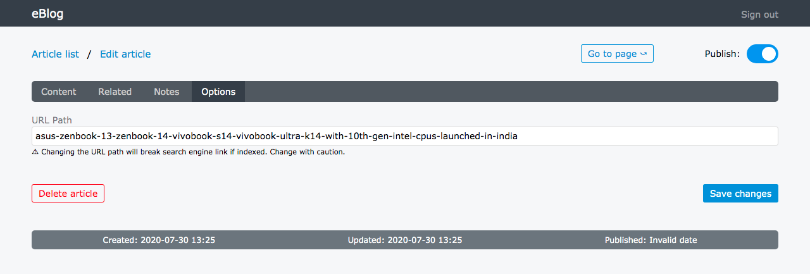

EmbedBlog is a LAMP based blog module that can be embedded in a static PHP site. It is based on the blog codebase used on www.diyrenewable.com

## Admin interface


List articles; display all, published or unpublished.


The article editor. The blog post content is separated from the meta information, so you can improve your SERP listing. Character counters to help creating ideal title and description length, and search result preview of the article.


Batch upload and select images. Only the images for the current article is shown, so you don't end up with chaos.


Ability to search and add related articles


Make notes and do research before you write the actual article.


Ability to change the URL path of the blog post.


## Features
* Dynamic, lightweight AJAX based admin interface
* Separate content and meta information (why, you say? If you need to include HTML in the summary, it will not affect the plain text meta information)
* Heading, summary, main picture and content editor (TinyMCE)
* Automatic image resizing and compressing to both thumbnail and full image
* Image picker with batch image uploading and processing
* Image picker shows only the current blog post images
* Publish and unpublish articles
* Per blog post URL path customization
* SERP and SEO improvement tools
* Related articles
* Take notes for each article
* SCSS and JS source code included

### Requirements
* PHP 7.* with GD (may work with PHP 5.x also, but untested)
* Apache webserver (can run on Nginx as well, but you'll need to change the .htaccess rewrite)
* MySQL or MariaDB
* You should be familiar with PHP programming and SQL in order to install or upgrade the blog system.

### Installation

1. Upload the www/blog/ folder directly to your public site folder (usually called www, public_html etc.). You should now have a blog folder located directly under the www root.
2. Rename or copy _htaccess to .htaccess
3. Rename or copy config.sample.php to config.php
4. Create a database, and import the database.sql file. Create a database user that has all the privileges to the database.
5. Edit the config.php file with the database server, username, password and database name. You can change other params as well.
6. CHMOD /www/blog/img/ to 0755 in order to be able to upload images

### Create an admin user
Before you can log into admin and create a blog post, you must add at least one admin user to your database:

1. Encrypt the password (encryption type: DES). You can use an online site like http://www.visiospark.com/password-encryption-tool/ to do so. Copy the DES encrypted password.
2. Log into the database and add a new record to the blog_admins table. The username should be a valid email address (lowercase only) and for the password, paste the encryptet password string into the password column/field. Leave sid and exp untouched.

### Log in
- Go to your website at /blog/admin/
- Log in with the username and password you created in the previous step

### Upgrading with new source code version
If you want to upgrade to a new version of the eBlog system, there are a few best practices to follow:
* Make sure to backup everything inside the blog folder. Also, create a dump of the blog database.
* In most cases it is sufficient to upgrade/replace only the following folders from the new version:
	* /www/blog/admin/
	* /www/blog/logic/
* In some cases, the database structure, config.php and .htaccess has been updated as well. Compare your current config.php and .htaccess file with the new. There are several ways to compare the database structure, but if you're familiar with MySQL queries and dump files, you can make a dump (structure only) of your current database, and compare it with the new database.sql file. https://www.diffchecker.com/ can be a useful tool to compare any changes to the database.

## List and display blog posts

There are two main views: list articles and display article. There are two example files in /www/blog/:
* index.php : This is the blog post listing
* blogpost.php : This is the blog post template

You may use .htaccess (for Apache web servers) file to rewrite and "prettify" the blog post URL (or configure it otherwise if using nginx or other web servers), but it's also possible to just run it directly on blogpost.php like this:
* blogpost.php?url_path=urlpath

### Article listing

Initiate the blog listing:

```php
require_once('./logic/classes/blogviewer_list.class.php');
$BWLObj = new blogviewer_list;
```

Options:
```php
// The time and date format, https://www.php.net/manual/en/datetime.formats.date.php
// Default value: Y-m-d
$BWLObj->setDateFormat('Y-m-d');

// Full URL to a default picture if to chosen in article
// Default value: https://via.placeholder.com/200x150
$BWLObj->setDefaultImage('https://picsum.photos/200/150');

// The URL path where all the pictures (thumbnails) are located.
// Default value: //<yourdomain>/blog/img/tn/
$BWLObj->setLeadingImgPath('https://<yourdomain>/blog/img/tn/');
```

Then, load the list of articles:
```php
$BWLObj->listArticles();
```

To loop through, and display the articles:
```php
foreach ($BWLObj->getListIndex() as $i) {
	// Each article template goes here

	// Functions to fetch content from each article:

	// Get image (file name)
	print $BWLObj->getImage($i);

	// Get the article path
	print $BWLObj->getPath($i);
	// Remember to puth the leading path in front, e.g.:
	<a href="/blog/post/<?php print $BWLObj->getPath($i); ?>/">Read more</a>

	// Title
	print $BWLObj->getTitle($i);

	// Summary
	print $BWLObj->getSummary($i);

	// Time created
	// $format is optional and can be set to override the format set with setDateFormat()
	print $BWLObj->getTimeCreated($i,[string $format]);

	// Time updated
	// $format is optional and can be set to override the format set with setDateFormat()
	print $BWLObj->getTimeUpdated($i,[string $format]);
}
```

## Display article

Initiate the blog article:

```php
require_once('./logic/classes/blogviewer_article.class.php');
$BWAObj = new blogviewer_article;
```

Options:
```php
// The time and date format, https://www.php.net/manual/en/datetime.formats.date.php
// Default value: Y-m-d
$BWAObj->setDateFormat('Y-m-d');
```

Load the article:
```php
if (is_object($BWAObj) && $BWAObj->setURLPath($_REQUEST['url_path']) && $BWAObj->loadArticle() && $BWAObj->loadRelated()) {
	// Article content goes here

	// Functions to fetch content from the article:

	// Meta title
	print $BWAObj->getMetaTitle();

	// Meta description
	print $BWAObj->getMetaDescription();

	// Title / heading
	print $BWAObj->getTitle();

	// Summary
	print $BWAObj->getSummary();

	// Content
	print $BWAObj->getContent();

	// Time created
	// $format is optional and can be set to override the format set with setDateFormat()
	print $BWAObj->getTimeCreated([string $format]);

	// Time updated
	// $format is optional and can be set to override the format set with setDateFormat()
	print $BWAObj->getTimeUpdated([string $format]);

	// Loop through related articles:

	foreach ($BWAObj->getRelatedIndex() as $i) {
		// Each related article record goes here

		// Related article path
		print $BWAObj->getRelPath($i);
		// Remember to puth the leading path in front, e.g.:
		<a href="/blog/post/<?php print $BWAObj->getRelPath($i); ?>/">Read more</a>

		// Related article title
		print $BWAObj->getRelTitle($i);

		// Related article summary
		print $BWAObj->getRelSummary($i);
	}

}
else {
	// Invalid path, 404 goes here
	http_response_code(404);
	print "404 Not found";
	exit;
}
```